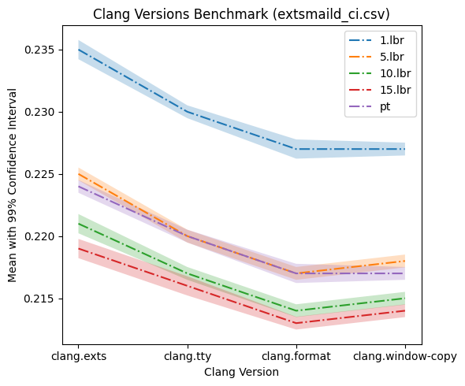

### NO LBR

| Benchmarked on / clang versions | Baseline clang | clang.extsmaild.c (1781) | clang.tty.c       (3026) | clang.format.c (5188) | clang.window-copy.c (5662) |
| --- | --- | --- | --- | --- | --- |
| format.c | 0.907 ± 0.0008 | 0.737 ± 0.0061 | 0.739 ± 0.0074 | 0.739 ± 0.0089 | 0.735 ± 0.0005 |
| tty.c | 0.557 ± 0.0008 | 0.449 ± 0.0005 | 0.451 ± 0.0005 | 0.451 ± 0.0005 | 0.450 ± 0.0005 |
| window-copy.c | 0.880 ± 0.0008 | 0.715 ± 0.0008 | 0.718 ± 0.0005 | 0.717 ± 0.0008 | 0.717 ± 0.0005 |
| extsmaild.c | 0.251 ± 0.0005 | 0.209 ± 0.0005 | 0.209 ± 0.0005 | 0.209 ± 0.0005 | 0.209 ± 0.0005 |

The range (Mean ± CI) for each run using clang binaries overlaps significantly
delta is not large enough to conclude relationship between LOC and performance.

Reason: in no lbr mode even the other formats are not giving enough information
to make significant performance difference that lbr and intel-pt does?

## LBR

| Benchmarked on / clang versions | Baseline clang | clang.extsmaild.c (1781) | clang.tty.c       (3026) | clang.format.c (5188) | clang.window-copy.c (5662) |
| --- | --- | --- | --- | --- | --- |
| format.c | 0.907 ± 0.0008 | 0.736 ± 0.0082 | 0.731 ± 0.0070 | 0.725 ± 0.0093 | 0.723 ± 0.0005 |
| tty.c | 0.557 ± 0.0008 | 0.450 ± 0.0005 | 0.444 ± 0.0005 | 0.442 ± 0.0005 | 0.442 ± 0.0005 |
| window-copy.c | 0.880 ± 0.0008 | 0.716 ± 0.0008 | 0.710 ± 0.0008 | 0.705 ± 0.0008 | 0.704 ± 0.0008 |
| extsmail.c | 0.251 ± 0.0005 | 0.209 ± 0.0005 | 0.207 ± 0.0005 | 0.205 ± 0.0005 | 0.206 ± 0.0005 |

Increase in LOC profiled function trends overall in better performance with
equal or deminishing returns over increasing LOC. In any case, extsmaild.c
profiled clang performs worse among optimized clangs.

## Intel PT

| Benchmarked on / clang versions | Baseline clang | clang.extsmaild.c (1781) | clang.tty.c       (3026) | clang.format.c (5188) | clang.window-copy.c (5662) |
| --- | --- | --- | --- | --- | --- |
| format.c | 0.907 ± 0.0008 | 0.723 ± 0.006 | 0.709 ± 0.0009 | 0.701 ± 0.009 | 0.701 ± 0.0008 |
| tty.c | 0.557 ± 0.0008 | 0.441 ± 0.0005 | 0.430 ± 0.0005 | 0.429 ± 0.0005 | 0.428 ± 0.0005 |
| window-copy.c | 0.880 ± 0.0008 | 0.705 ± 0.0008 | 0.689 ± 0.0008 | 0.684 ± 0.0008 | 0.680 ± 0.0008 |
| extsmail.c | 0.251 ± 0.0005 | 0.205 ± 0.0005 | 0.203 ± 0.0005 | 0.201 ± 0.0005 | 0.202 ± 0.0005 |

Like LBR mode, increase in LOC tends to better the performance with
significantly diminishing returns over increase in clang profiled with bigger
files. 

Example, look at format.c run, when compare extsmaild.c profiled clang to tty.c
profiled clang the delta is 0.014 seconds while comparing tty.c profiled clang
to format.c profiled clang is 0.008. And comparing clang profiled from format.c
and window-copy.c, delta is neglible (in one case it becomes worse).

### **Q: Is LBR data worse than NO LBR in any of the runs (compare best of NO LBR and worst of LBR)**

extsmaild.c profiled clang gives overall the best results in NO LBR format, and
worst in NO LBR format. The Mean ±  CI range overlaps significantly that we
cannot say that LBR performs worse. 

### **Q: Is Intel PT data worse than LBR in any of the runs (compare best of LBR and worst of LBR)**

Similar to LBR case, the best case in LBR (window-copy.c profiled clang) and
worst case in Intel PT mode (extsmaild.c profiled clang) overlaps but can’t be
claimed that PT is worse. With same profiled clang(s) Intel PT performs overall
better.

### **Number of functions executed by clang versions(row headers) during file compilations (column headers)**

| binaries / files | extsmaild.c | tty.c | format.c | window-copy.c  | 
| --- | --- | --- | --- | --- |   
| clang-16.nolbr.format | 14862 | 14740 | 15487 | 15858 | 
| clang-16.nolbr.tty | 14869 | 14747 | 15494 | 15865 | 
| clang-16.nolbr.window-copy | 14860 | 14738 | 15486 | 15857 | 
| clang-16.nolbr.exts | 14871 | 14751 | 15497 | 15868 |  
| clang-16.lbr.format | 20889 | 20856 | 21761 | 22056 |
| clang-16.lbr.tty | 19622 | 19622 | 20399 | 20780 |
| clang-16.lbr.window-copy | 20799 | 20800 | 21671 | 22012 |
| clang-16.lbr.exts | 17964 | 17847 | 18631 | 19003 | 
| clang-16.pt.format. | 24711 | 24775 | 26062 | 26223 |
| clang-16.pt.tty | 23694 | 23878 | 24858 | 25141 | 
| clang-16.pt.window-copy | 24713 | 24837 | 25973 | 26335 | 
| clang-16.pt.exts | 22387 | 22301 | 23253 | 23547 | 

### **Comparing clang versions obtained from aggregating LBR profiles running _n_ times on a file with clang obtained from Intel PT mode profile running 1 time on the same file**

<figure>
  
  <figcaption style="font-size: small; font-style: italic;">In figure above, the x-axis is versions of clang (obtained with
  profile captured during file’s compilation (i.e clang.exts is clang optimized
  with llvm-bolt after gathering profile during extsmaild.c file compilation).
  The y-axis is the mean values. the line (-.) is clang aggregated with number
  of profiles (compiling the same file). And the shaded region is 99%
  confidence interval.</figcaption> 
</figure>

<figure>
  
</figure>

<figure>
  
</figure>

In the above image, since the clang versions aggregated with 5, 10 and 15
profiles overlaps with Intel PT clang we cannot say definitely which one is
better but aggregating LBR profiles and generating clang with 5 or more profile
seems to give closer results in terms of performance with Inetl PT clang.

<figure>
  
</figure>
